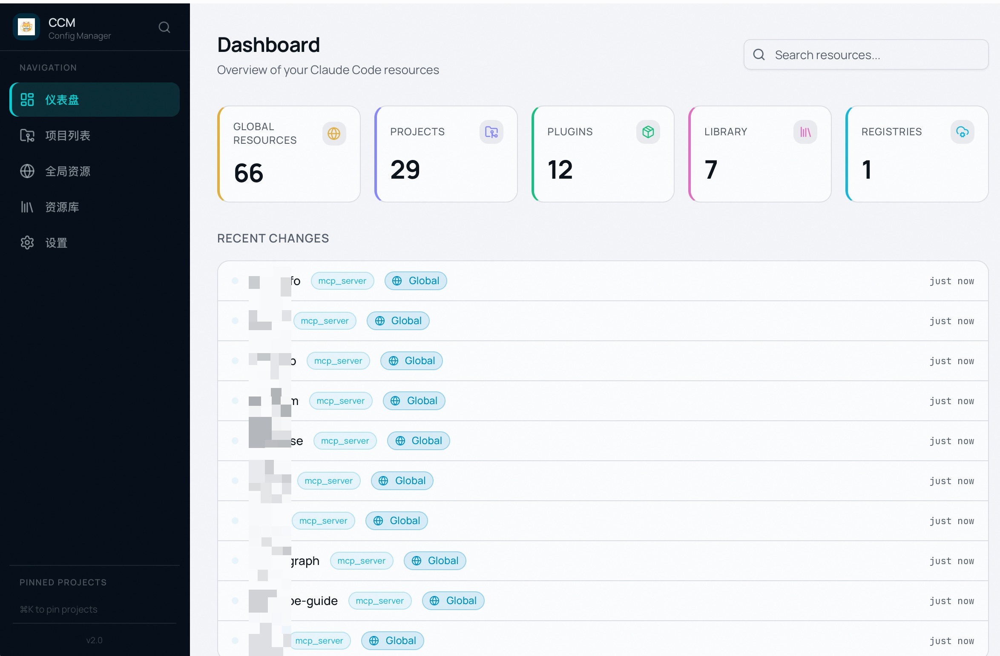

# CCM — Claude Config Manager


**一款管理所有项目 Claude Code 配置的桌面应用。**



## 痛点

如果你在多个项目中使用 [Claude Code](https://docs.anthropic.com/en/docs/claude-code)，你一定会遇到这些问题：

- **配置散落各处** — Skills、Agents、Rules、Hooks、Commands 分散在每个项目的 `.claude/` 目录中，没有统一的地方查看和管理。
- **无法复用** — 你在 A 项目写了一个好用的 Skill，想在 B 项目用只能手动复制，之后两份文件各自演化，再也无法同步。
- **缺乏全局视角** — 哪些项目配了 Claude？全局有哪些资源？MCP Server 跑了几个？你只能一个一个目录翻。
- **重复劳动** — 每个新项目都要重新配置环境变量、复制常用规则、设置权限，周而复始。
- **团队无法共享** — 没有机制在团队内分发 Claude 配置，每个开发者各自维护一套。

## 解决方案

CCM 为你提供一个 **中央控制台**，统管所有项目的 Claude Code 配置，支持共享资源库、远程注册表和跨项目资源管理。

**一目了然。** 一个仪表盘展示所有项目、资源、插件和 MCP Server，全局搜索即刻找到。

**一次编写，处处使用。** 将资源存入中央库（`~/.claude-manager/library/`），通过符号链接安装到任意项目。更新库中的版本，所有链接的项目自动同步。

**团队共享。** 基于 Git 的注册表让团队发布、版本管理和分发 Claude 配置 —— Skills、Agents、Rules 以及完整的插件包。

**自动化集成。** 本地 HTTP API 让你可以与 Raycast、Alfred、Shell 脚本或任何 HTTP 工具集成。

---

## 功能

### 项目管理

- **自动发现** — 扫描文件系统和 `~/.claude/projects.json`，找到所有配置了 Claude 的项目
- **语言检测** — 通过构建文件识别项目语言（Go、Rust、TypeScript、Python、Java 等）
- **快速启动** — 一键在终端打开 Claude Code，自动注入环境变量并记录启动历史
- **收藏置顶** — 置顶常用项目，在命令面板中快速访问
- **终端选择** — 支持 Terminal.app、iTerm2 或 Warp

### 资源管理

管理六种 Claude Code 资源类型：

| 类型 | 说明 |
|------|------|
| **Skills** | 可复用的指令块和领域知识 |
| **Agents** | AI 代理定义和人设 |
| **Rules** | Claude 的行为准则 |
| **Hooks** | 事件钩子（JSON 配置） |
| **Commands** | 自定义斜杠命令 |
| **MCP Servers** | Model Context Protocol 服务器配置 |

每种资源可存在于多个作用域：

- **全局** (`~/.claude/`) — 对所有项目生效
- **项目** (`project/.claude/`) — 仅对单个项目生效
- **资源库** (`~/.claude-manager/library/`) — 中央可复用存储
- **注册表** — 通过 Git 注册表共享

### 中央资源库

- 将资源存储在 `~/.claude-manager/library/` 作为唯一数据源
- **安装到项目** — 通过符号链接或复制将库资源安装到任意项目
- **部署到全局** — 将库资源推送到 `~/.claude/` 供所有项目使用
- **插件包** — 将多个资源打包为可安装的插件
- **链接健康检查** — 验证所有符号链接是否有效

### 注册表系统

- **基于 Git 共享** — 通过 URL 添加注册表，git pull/push 同步
- **应用市场** — 浏览团队或社区注册表中的插件和资源
- **发布** — 将你的资源和插件包发布到可写注册表
- **安装** — 从注册表拉取资源或插件到库、项目或全局

### 插件管理

- **扫描已安装插件** — 检测 `~/.claude/plugins/` 中的插件
- **提取到资源库** — 从插件中提取单个资源以便复用
- **注册表插件** — 从注册表安装带 MCP Server 支持的外部插件
- **自建插件包** — 创建和管理自己的插件包

### MCP Server 管理

- 查看 `.mcp.json` 中的 MCP Server（全局和项目级）
- 显示服务类型、命令、参数、URL 和环境变量
- 追踪插件和注册表提供的 MCP Server

### 环境变量

- **全局环境变量** — 设置每次启动 `claude` CLI 时传入的变量
- **项目环境变量** — 按项目覆盖或扩展全局变量
- **合并视图** — 查看每个项目最终计算后的环境变量
- 启动终端时自动注入

### 同步

- **全量同步** — 在所有作用域中协调文件系统状态与数据库
- **文件监听** — 实时检测 `~/.claude/` 和 `~/.claude-manager/` 的变更
- **内容哈希** — 通过文件哈希检测修改，而非仅依赖时间戳
- 六阶段同步，支持进度上报

### 外部工具集成

CCM 提供本地 HTTP API，任何工具都可以调用 —— Raycast、Alfred、Shell 脚本、CI 流水线或自定义面板。

#### HTTP API

| 端点 | 说明 |
|------|------|
| `GET /api/health` | 健康检查（无需认证） |
| `GET /api/projects?q=关键字` | 搜索/列出项目 |
| `GET /api/projects/:id` | 项目详情 |
| `POST /api/projects/:id/launch` | 在项目中启动 Claude Code |

- Bearer Token 认证（SHA-256 哈希，常量时间比较）
- 在设置界面生成 Token（仅显示一次，支持复制）
- 可配置端口（默认：23890）
- 运行时启停，无需重启

#### Raycast

内置 Raycast Extension（`raycast-extension/`）：

- **搜索项目** — 在 Raycast 中实时搜索项目
- **启动 Claude Code** — 选中项目按 Enter 即刻启动
- **复制路径** — 复制项目路径到剪贴板
- 在 Raycast 偏好设置中配置 API Token 和端口

#### Alfred

内置 Alfred Workflow（`alfred-workflow/`）：

- **搜索项目** — 输入 `ccm` 关键字搜索项目
- **启动 Claude Code** — Enter 启动
- **复制路径** — Cmd+Enter 复制项目路径
- **打开 Finder** — Alt+Enter 在 Finder 中打开项目
- 在 Workflow 环境变量中配置 API Token 和端口

#### Shell 脚本

```bash
# 列出所有项目
curl -s -H "Authorization: Bearer $CCM_TOKEN" \
  http://127.0.0.1:23890/api/projects | jq '.data[].name'

# 按名称启动项目
ID=$(curl -s -H "Authorization: Bearer $CCM_TOKEN" \
  "http://127.0.0.1:23890/api/projects?q=myapp" | jq -r '.data[0].id')
curl -s -X POST -H "Authorization: Bearer $CCM_TOKEN" \
  "http://127.0.0.1:23890/api/projects/$ID/launch"
```

### 系统托盘

- 关闭窗口后应用常驻系统托盘
- 托盘菜单：显示窗口、API 状态、退出
- 窗口隐藏后 HTTP API 仍可访问

### 设置

- **网络代理** — 支持 HTTP/HTTPS 或 SOCKS5 代理用于注册表同步（支持连接测试）
- **命令面板** — 全局快捷键（默认：`Meta+K`），可自定义
- **终端** — 选择偏好的终端应用
- **HTTP API** — 启停、端口、Token 管理

---

## 技术栈

| 层级 | 技术 |
|------|------|
| 框架 | [Tauri 2.x](https://v2.tauri.app/) |
| 前端 | React 19 + TypeScript |
| 后端 | Rust |
| UI | [shadcn/ui](https://ui.shadcn.com/) + Tailwind CSS v4 |
| 状态管理 | Zustand v5 |
| 数据库 | SQLite（rusqlite） |
| HTTP API | axum |
| 路由 | react-router-dom v7 |

## 快速开始

### 前置条件

- [Node.js](https://nodejs.org/) (v18+)
- [Rust](https://rustup.rs/) 工具链
- macOS（符号链接功能需要 Unix 系统）

### 开发

```bash
# 安装依赖
npm install

# 启动开发模式（Vite + Tauri）
npm run tauri dev

# 运行前端测试
npm test

# 运行后端测试
cd src-tauri && cargo test
```

### 构建

```bash
# 为当前架构构建
npm run tauri build
```

#### macOS — Apple Silicon (arm64)

在 Apple Silicon Mac（M1/M2/M3/M4）上，`npm run tauri build` 默认生成 arm64 二进制文件。

在 Apple Silicon 上交叉编译 Intel 版本：

```bash
rustup target add x86_64-apple-darwin
npm run tauri build -- --target x86_64-apple-darwin
```

#### macOS — Intel (x86_64)

在 Intel Mac 上，`npm run tauri build` 默认生成 x86_64 二进制文件。

在 Intel 上交叉编译 Apple Silicon 版本：

```bash
rustup target add aarch64-apple-darwin
npm run tauri build -- --target aarch64-apple-darwin
```

#### macOS — 通用二进制

构建通用二进制（在 Intel 和 Apple Silicon 上均原生运行）：

```bash
rustup target add x86_64-apple-darwin aarch64-apple-darwin
npm run tauri build -- --target universal-apple-darwin
```

构建产物位于 `src-tauri/target/release/bundle/`，包含 `.app`、`.dmg` 和 `.pkg` 格式。

### 平台支持

| 平台 | 状态 | 说明 |
|------|------|------|
| **macOS (arm64)** | 完全支持 | 主要开发平台 |
| **macOS (x86_64)** | 完全支持 | 可从 arm64 交叉编译或原生构建 |
| **Linux** | 部分支持 | 可构建运行，符号链接功能正常。终端启动使用了 macOS 专属的 `osascript`，需要为 Linux 终端（如 gnome-terminal、kitty）做平台适配。系统托盘取决于桌面环境支持。 |
| **Windows** | 暂不支持 | 符号链接管理使用 `#[cfg(unix)]` 守卫，Windows 符号链接需要管理员权限且使用不同 API。终端启动为 macOS 专属（`osascript`）。欢迎社区贡献适配。 |

### Raycast Extension

```bash
cd raycast-extension
npm install
npm run dev    # 加载到 Raycast
```

### Alfred Workflow

```bash
cd alfred-workflow
zip -r ../CCM.alfredworkflow . -x "README.md" -x ".DS_Store"
# 双击 CCM.alfredworkflow 导入 Alfred
```

## 数据存储

所有数据存储在本地：

| 路径 | 内容 |
|------|------|
| `~/.claude-manager/ccm.db` | SQLite 数据库（项目、资源、设置） |
| `~/.claude-manager/library/` | 中央资源库 |
| `~/.claude-manager/registries/` | Git 注册表本地克隆 |
| `~/.claude/` | Claude Code 全局配置（由 CCM 管理） |

## 许可证

MIT
